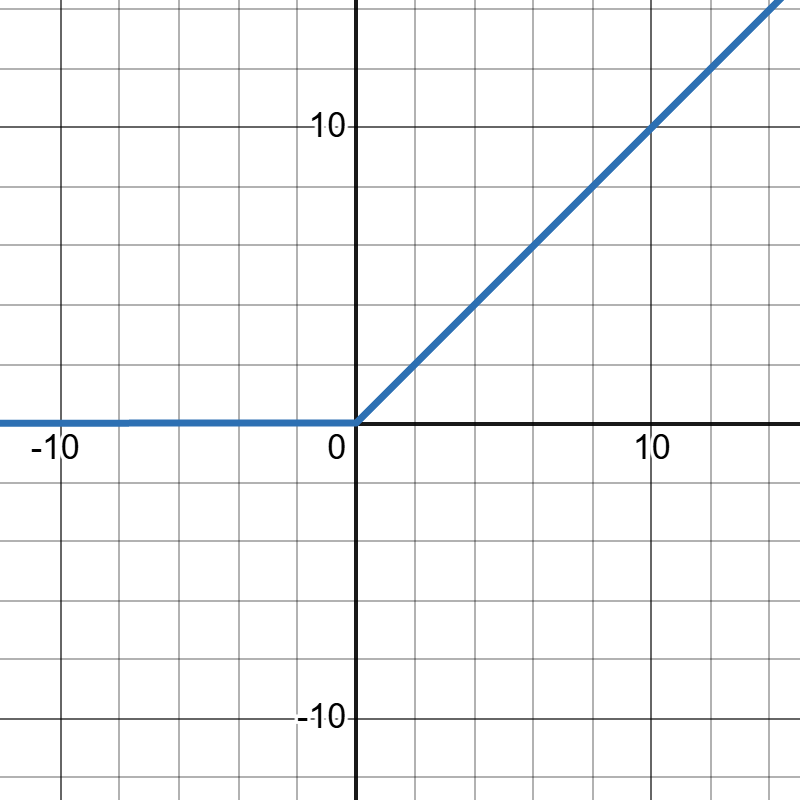
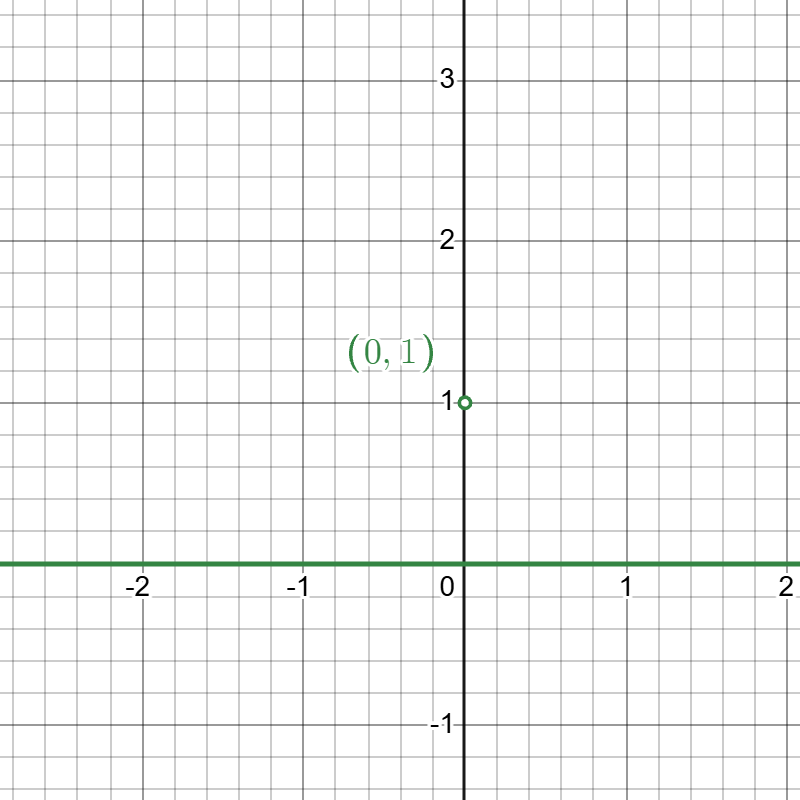
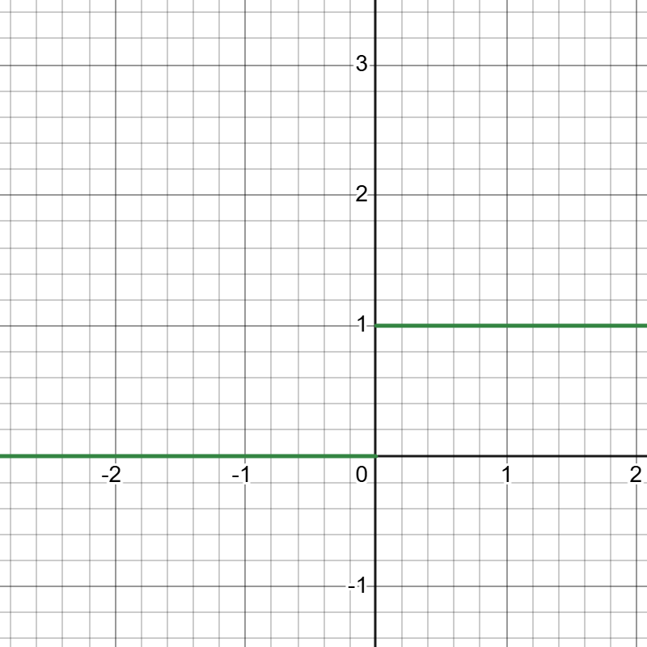
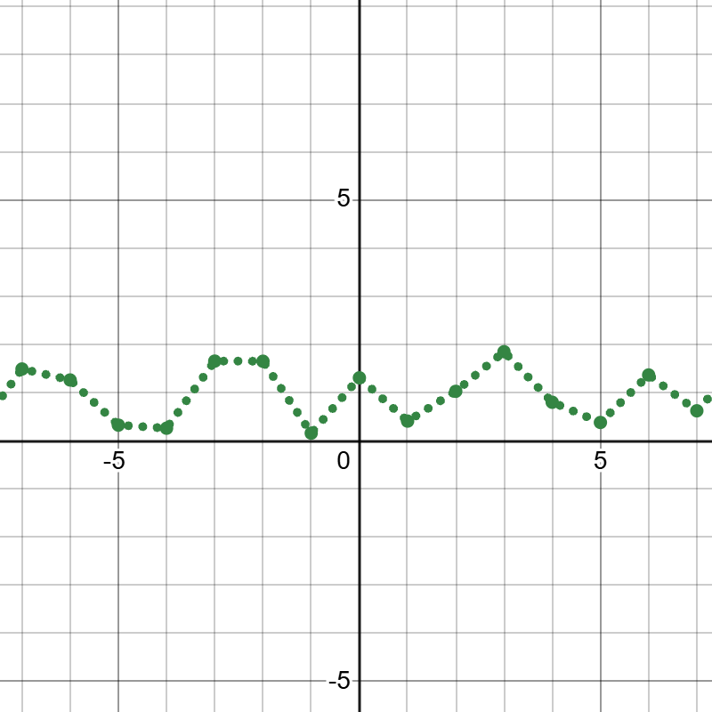
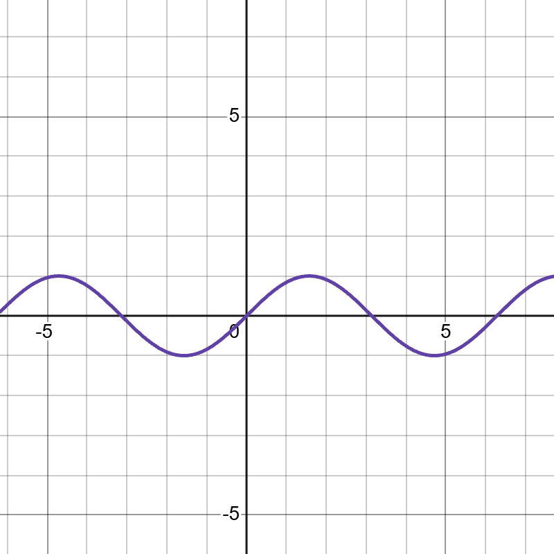
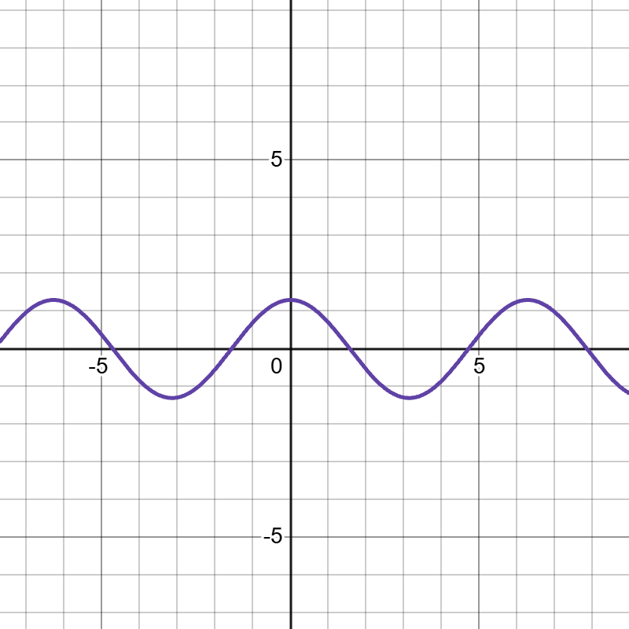
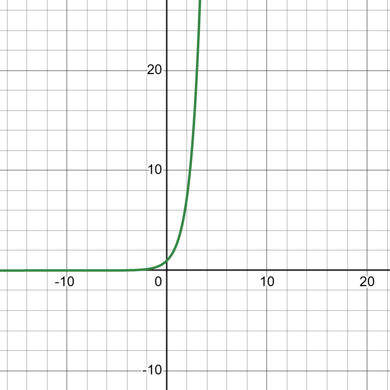
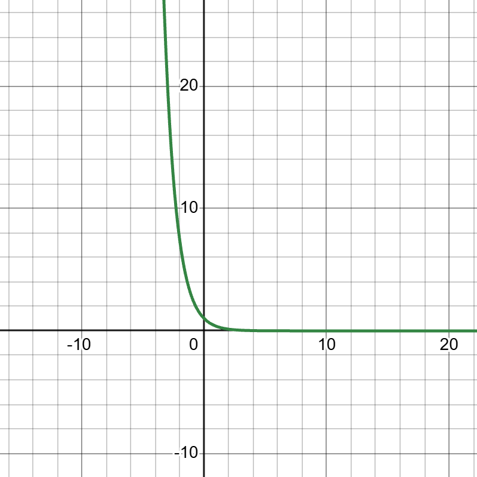
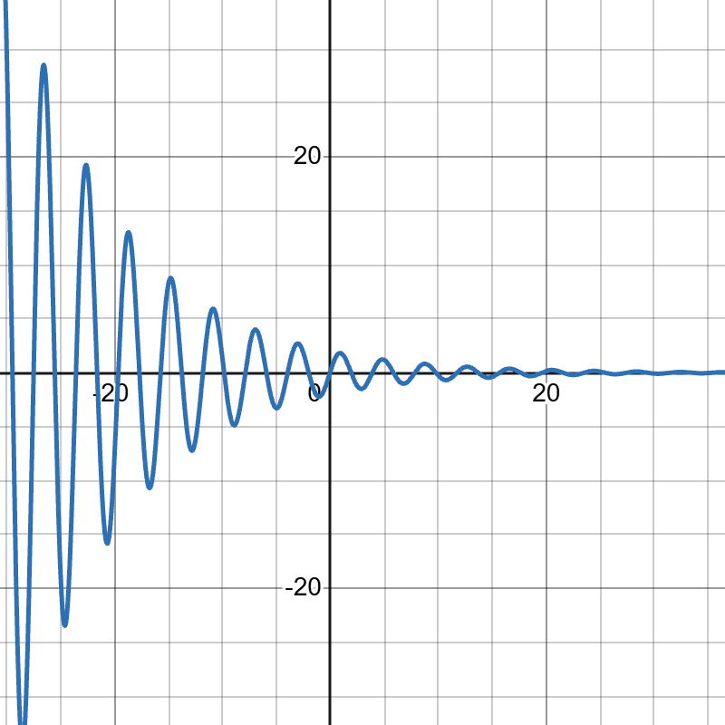

# SciLabry
Scilab programming assignments and lab work completed as part of my undergraduate coursework at Sister Nivedita University. 

---

## Setup 
If you don't have scilab setup on your system you can download it from [here](https://www.scilab.org/download).

## Experiments
| Sl No. | Experiment                                              | Assignment Count | 
| :-:    | :-:                                                     | :-:              |
|  1.    | [Mathematical calculations using Scilab](#experiment-i) | 6                |
|  2.    | [Generation of Signals](#experiment-ii)                 | 8                |

## Experiment I
Mathematical calculations using Scilab.

### Aim 
To calculate mathematical operations like addition, subtraction, multiplication, division and matrix operations.

### Theory 
Scilab is an open source software for numerical computation. It provides a powerful environment for scientific and engineering applications. It features a high level programming language used for critical Mathematical theorems and calculations. You can create 2D, 3D plotting for tasks like modelling, simulation. It is available for Windows, Linux and Mac OS. It has a rich library of mathematical functions for research purpose and projects for students. 

### Assignment I
Perform basic arithmetic calculations without using variables.

```
--> 347 + 3127
 ans  =

   3474.

--> 45.90 - 40.56
 ans  =

   5.3400000

--> 45 .* 7.4
 ans  =

   333.

--> 1.19 / 6.7
 ans  =

   0.1776119
```

### Assignment II
Perform basic arithmetic calculations using variables.

```
--> A = 15.67; B = 53.78; C = -12.45;

--> D = (A .* B)
 D  = 

   842.7326

--> D = (C - B)
 D  = 

  -66.23

--> D = (C / A)
 D  = 

  -0.7945118

--> D = (A + B)
 D  = 

   69.45
```

### Assignment III
Create Matrices of the given orders.

- `3x3`
- `2x5`
- `6x3`
- `8x2`
- `5x4`

```
--> [1 2 3; 4 5 6; 7 8 9]
 ans  =

   1.   2.   3.
   4.   5.   6.
   7.   8.   9.

--> [1 2 3 4 5; 6 7 8 9 10]
 ans  =

   1.   2.   3.   4.   5. 
   6.   7.   8.   9.   10.

--> [1 2 3; 4 5 6; 7 8 9; 10 11 12; 13 14 15; 16 17 18]
 ans  =

   1.    2.    3. 
   4.    5.    6. 
   7.    8.    9. 
   10.   11.   12.
   13.   14.   15.
   16.   17.   18.

--> [1 2 ; 3 4; 5 6; 7 8; 9 10; 11 12; 13 14; 15 16]
 ans  =

   1.    2. 
   3.    4. 
   5.    6. 
   7.    8. 
   9.    10.
   11.   12.
   13.   14.
   15.   16.

--> [1 2 3 4; 5 6 7 8; 9 10 11 12; 13 14 15 16; 17 18 19 20]
 ans  =

   1.    2.    3.    4. 
   5.    6.    7.    8. 
   9.    10.   11.   12.
   13.   14.   15.   16.
   17.   18.   19.   20.
```

### Assignment IV
Perform basic Matrix operations (Addition, Subtraction and Multiplication).

```
--> matrixA = [1 2 3; 4 5 6; 7 8 9]
 matrixA  = 

   1.   2.   3.
   4.   5.   6.
   7.   8.   9.

--> matrixB = [1 0 0; 0 1 0; 0 0 1]
 matrixB  = 

   1.   0.   0.
   0.   1.   0.
   0.   0.   1.

--> matrixA + matrixB
 ans  =

   2.   2.   3. 
   4.   6.   6. 
   7.   8.   10.

--> matrixA - matrixB
 ans  =

   0.   2.   3.
   4.   4.   6.
   7.   8.   8.

--> matrixA .* matrixB
 ans  =

   1.   0.   0.
   0.   5.   0.
   0.   0.   9.
```

> [!NOTE]
> As we can see `.*` multiplies each corresponding element with the element from the other matrix. This is different that the normal `*` we are familiar with. 

### Assignment V
Perform a simplification.

```
--> A = -19.1952159;

--> B = -63.16594;

--> C = 16.193;

--> D = 91.6125105;

--> E = [(A .* C) + (B .* D)] / [A .* (B + D) .* (B + A - C)]
 E  = 

  -0.1133085
```

### Assignment VI
`(i).` Calculate the perimeter of a circle.

```
--> pi = 3.14159265359;

--> r = 23.1967;

--> peri = 2 * pi * r
 peri  = 

   145.74916
```

`(ii).` Calculate the area of a Rectangle and a Triangle.

```
--> l = 12.135; b = 13.196;

--> area_r = l * b
 area_r  = 

   160.13346

--> b = 21.5349; h = 34.113;

--> area_t = 1/2 * b * h
 area_t  = 

   367.31002
```

`(iii).` Calculate Simple Interest.

```
--> p = 5000; t = 3; r = 8.9;

--> SI = (p * r * t) / 100
 SI  = 

   1335.
```

### Conclusion
I have gained knowledge about scilab software and did Mathematical calculations like addition, subtraction, multiplication, division and matrix operations.

## Experiment II
Generation of Signals.

### Aim 
To generate several signals using SciLab.

### Theory 

`(i).` Ramp Signal
```
r(t) = 0, t <  0
     = t, t >= 0
```


`(ii).` Unit Impulse
```
delta(n) = 1, n =  0
	       = 0, n != 0
```


`(iii).` Unit Step Signal
```
f(x) = 0, x <  0
     = 1, x >= 0 
```


`(iv).` Random Signal 
The values are "randomly" generated based using a predefined formula.



`(v).` Sine Wave
```
f(x) = Asin(wt + phi)

w = 2PIf
f = Frequency
A = Amplitude
phi = Phase diff
```




`(vi).` Cosine Wave
```
f(x) = Acos(wt + phi)

w = 2PIf
f = Frequency
A = Amplitude
phi = Phase diff
```



`(vii).` Exponential Wave
```
f(x) = exp(alpha * time)
```



`(viii).` Damped Sine Wave
```
f(x) = Ae(-alpha t) sin(wt + phi)

w = 2PIf
f = Frequency
A = Amplitude
phi = Phase diff
```


### Assignment I
Generate ramp signals.

`(i)`
```
t = [0:20];
y = t;
plot(t, y);
xlabel('Time');
ylabel('Amplitude');
title('Ramp Signal');
```


`(ii)`
```
t = [12 : 120];
y = t;
plot(t, y, "*r");
xlabel('Time');
ylabel('Amplitude');
title('Ramp Signal');
```


`(iii)`
```
t = [16.152 : 101.115];
y = t;
plot(t, y, 'sc');
xlabel('Time');
ylabel('Amplitude');
title('Ramp Signal');
```

