# SciLabry
Scilab programming assignments and lab work completed as part of my undergraduate coursework at Sister Nivedita University. 

---

## Setup 
If you don't have scilab setup on your system you can download it from [here](https://www.scilab.org/download).

## Experiments
| Sl No. | Experiment                                                           | Assignment Count | 
| :-:    | :-:                                                                  | :-:              |
|  1.    | [Mathematical calculations using Scilab](#experiment-i)              | 6                |
|  2.    | [Generation of Signals](#experiment-ii)                              | 8                |
|  3.    | [Operations of signals](#experiment-iii)                             | 6                |
|  4.    | [Determine odd and even part of a signal](#experiment-iv)            | 2                |
|  5.    | [Determine power and energy of a signal](#experiment-v)              | 2                |
|  6.    | [Convolution sum of 2 discrete sequences](#experiment-vi)            | 1                |
|  7.    | [Convolution integral of 2 continuous-time signals](#experiment-vii)  | 1                |

## Practice Problems

| Sl  | Questions |
| :-:|  :-:|
| 1.  | [Question 1](#question-1)   |
| 2.  | [Question 2](#question-2)   |
| 3.  | [Question 3](#question-3)   |
| 4.  | [Question 4](#question-4)   |
| 5.  | [Question 5](#question-5)   |
| 6.  | [Question 6](#question-6)   |
| 7.  | [Question 7](#question-7)   |
| 8.  | [Question 8](#question-8)   |
| 9.  | [Question 9](#question-9)   |
| 10. | [Question 10](#question-10) |
| 11. | [Question 11](#question-11) |
| 12. | [Question 12](#question-12) |
| 13. | [Question 13](#question-13) |
| 14. | [Question 14](#question-14) |
| 15. | [Question 15](#question-15) |
| 16. | [Question 16](#question-16) |
| 17. | [Question 17](#question-17) |

## Experiment I
Mathematical calculations using Scilab.

### Aim 
To calculate mathematical operations like addition, subtraction, multiplication, division and matrix operations.

### Theory 
Scilab is an open source software for numerical computation. It provides a powerful environment for scientific and engineering applications. It features a high level programming language used for critical Mathematical theorems and calculations. You can create 2D, 3D plotting for tasks like modelling, simulation. It is available for Windows, Linux and Mac OS. It has a rich library of mathematical functions for research purpose and projects for students. 

### Assignment I
Perform basic arithmetic calculations without using variables.

```
--> 347 + 3127
 ans  =

   3474.

--> 45.90 - 40.56
 ans  =

   5.3400000

--> 45 .* 7.4
 ans  =

   333.

--> 1.19 / 6.7
 ans  =

   0.1776119
```

### Assignment II
Perform basic arithmetic calculations using variables.

```
--> A = 15.67; B = 53.78; C = -12.45;

--> D = (A .* B)
 D  = 

   842.7326

--> D = (C - B)
 D  = 

  -66.23

--> D = (C / A)
 D  = 

  -0.7945118

--> D = (A + B)
 D  = 

   69.45
```

### Assignment III
Create Matrices of the given orders.

- `3x3`
- `2x5`
- `6x3`
- `8x2`
- `5x4`

```
--> [1 2 3; 4 5 6; 7 8 9]
 ans  =

   1.   2.   3.
   4.   5.   6.
   7.   8.   9.

--> [1 2 3 4 5; 6 7 8 9 10]
 ans  =

   1.   2.   3.   4.   5. 
   6.   7.   8.   9.   10.

--> [1 2 3; 4 5 6; 7 8 9; 10 11 12; 13 14 15; 16 17 18]
 ans  =

   1.    2.    3. 
   4.    5.    6. 
   7.    8.    9. 
   10.   11.   12.
   13.   14.   15.
   16.   17.   18.

--> [1 2 ; 3 4; 5 6; 7 8; 9 10; 11 12; 13 14; 15 16]
 ans  =

   1.    2. 
   3.    4. 
   5.    6. 
   7.    8. 
   9.    10.
   11.   12.
   13.   14.
   15.   16.

--> [1 2 3 4; 5 6 7 8; 9 10 11 12; 13 14 15 16; 17 18 19 20]
 ans  =

   1.    2.    3.    4. 
   5.    6.    7.    8. 
   9.    10.   11.   12.
   13.   14.   15.   16.
   17.   18.   19.   20.
```

### Assignment IV
Perform basic Matrix operations (Addition, Subtraction and Multiplication).

```
--> matrixA = [1 2 3; 4 5 6; 7 8 9]
 matrixA  = 

   1.   2.   3.
   4.   5.   6.
   7.   8.   9.

--> matrixB = [1 0 0; 0 1 0; 0 0 1]
 matrixB  = 

   1.   0.   0.
   0.   1.   0.
   0.   0.   1.

--> matrixA + matrixB
 ans  =

   2.   2.   3. 
   4.   6.   6. 
   7.   8.   10.

--> matrixA - matrixB
 ans  =

   0.   2.   3.
   4.   4.   6.
   7.   8.   8.

--> matrixA .* matrixB
 ans  =

   1.   0.   0.
   0.   5.   0.
   0.   0.   9.
```

> [!NOTE]
> As we can see `.*` multiplies each corresponding element with the element from the other matrix. This is different that the normal `*` we are familiar with. 

### Assignment V
Perform a simplification.

```
--> A = -19.1952159;

--> B = -63.16594;

--> C = 16.193;

--> D = 91.6125105;

--> E = [(A .* C) + (B .* D)] / [A .* (B + D) .* (B + A - C)]
 E  = 

  -0.1133085
```

### Assignment VI
`(i).` Calculate the perimeter of a circle.

```
--> pi = 3.14159265359;

--> r = 23.1967;

--> peri = 2 * pi * r
 peri  = 

   145.74916
```

`(ii).` Calculate the area of a Rectangle and a Triangle.

```
--> l = 12.135; b = 13.196;

--> area_r = l * b
 area_r  = 

   160.13346

--> b = 21.5349; h = 34.113;

--> area_t = 1/2 * b * h
 area_t  = 

   367.31002
```

`(iii).` Calculate Simple Interest.

```
--> p = 5000; t = 3; r = 8.9;

--> SI = (p * r * t) / 100
 SI  = 

   1335.
```

### Conclusion
I have gained knowledge about scilab software and did Mathematical calculations like addition, subtraction, multiplication, division and matrix operations.

## Experiment II
Generation of Signals.

### Aim 
To generate several signals using SciLab.

### Theory 

`(i).` Ramp Signal
```
r(t) = 0, t <  0
     = t, t >= 0
```
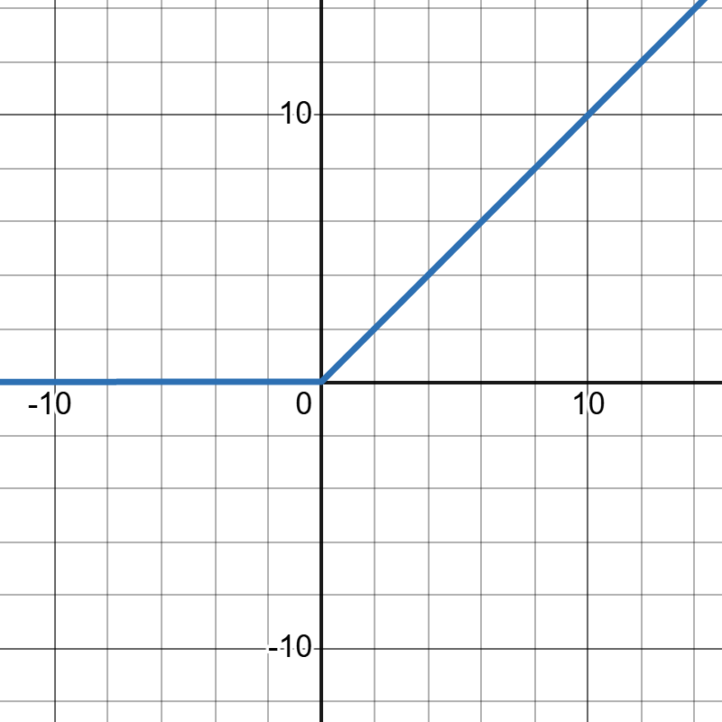

`(ii).` Unit Impulse
```
delta(n) = 1, n =  0
	       = 0, n != 0
```
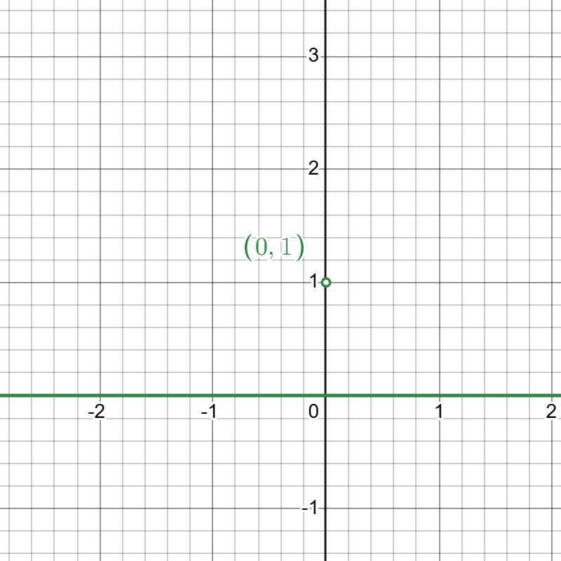

`(iii).` Unit Step Signal
```
f(x) = 0, x <  0
     = 1, x >= 0 
```
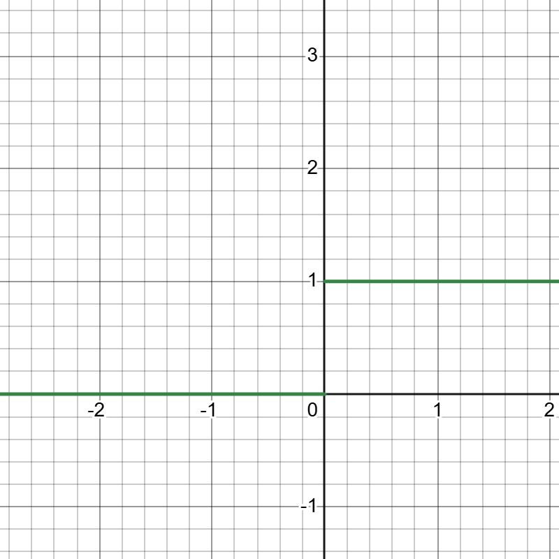

`(iv).` Random Signal 
The values are "randomly" generated using a predefined formula.

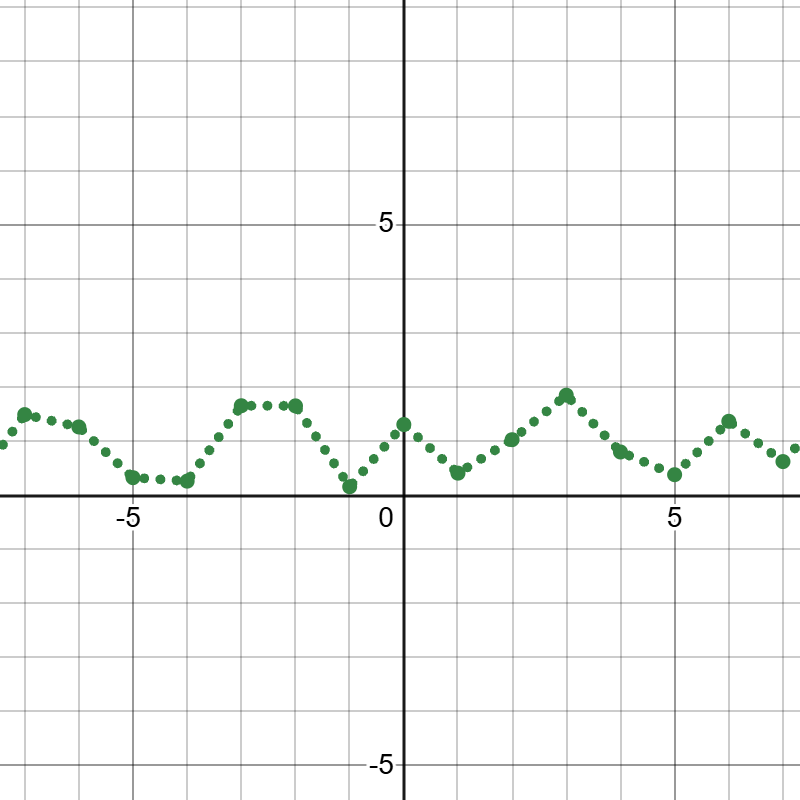

`(v).` Sine Wave
```
f(t) = Asin(wt + phi)

w = 2PIf
f = Frequency
A = Amplitude
phi = Phase diff
```

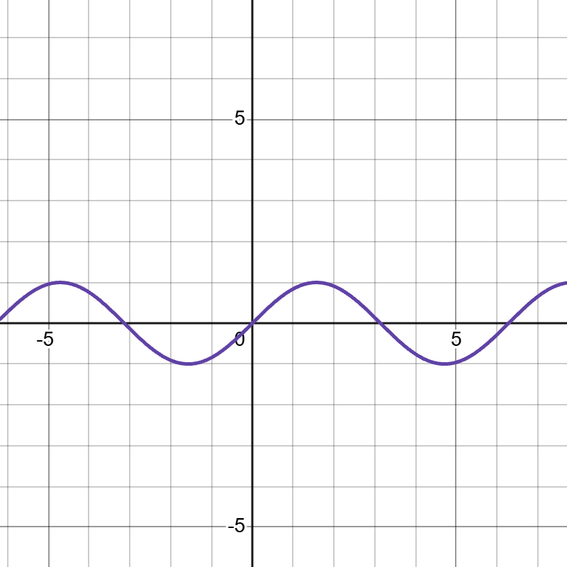


`(vi).` Cosine Wave
```
f(t) = Acos(wt + phi)

w = 2PIf
f = Frequency
A = Amplitude
phi = Phase diff
```
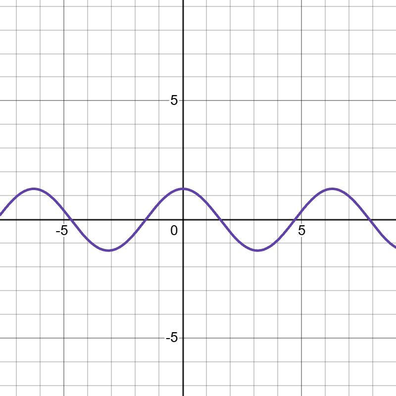


`(vii).` Exponential Wave
```
f(t) = exp(alpha * t)
```
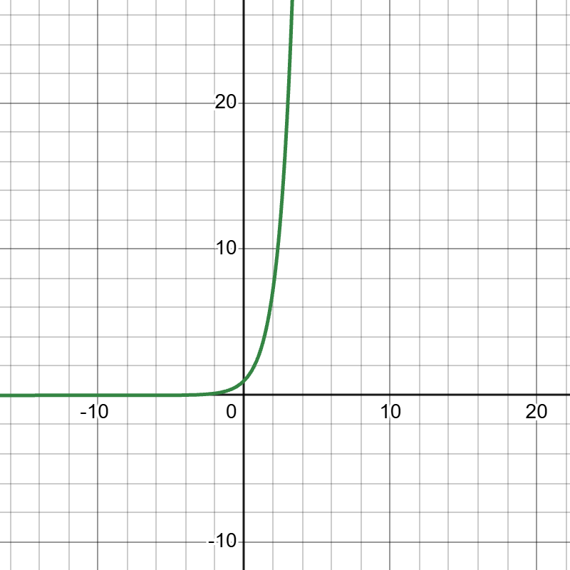
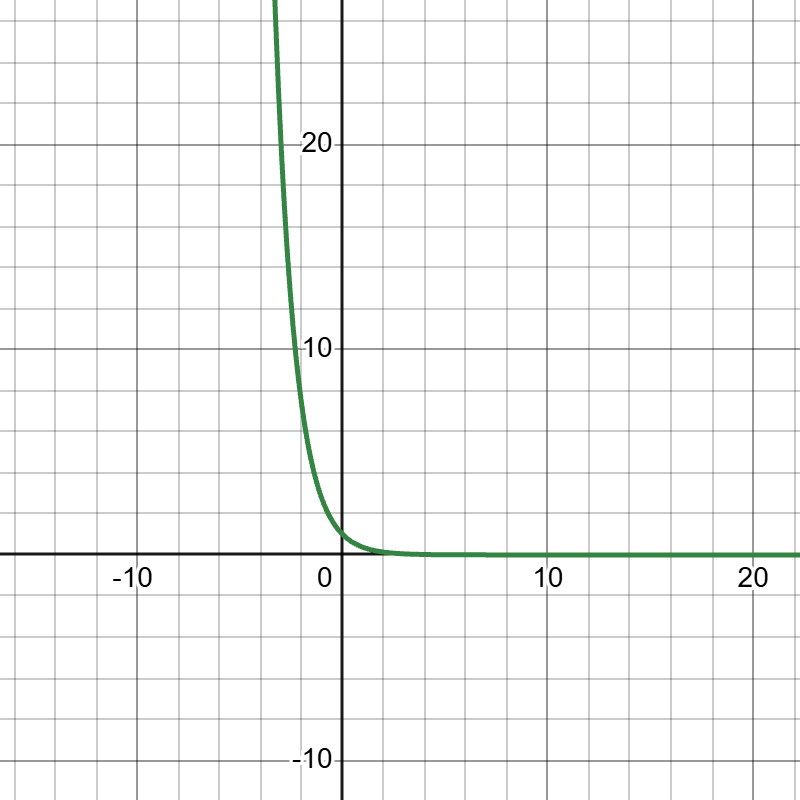

`(viii).` Damped Sine Wave
```
f(t) = Ae(-alpha t) sin(wt + phi)

w = 2PIf
f = Frequency
A = Amplitude
phi = Phase diff
```
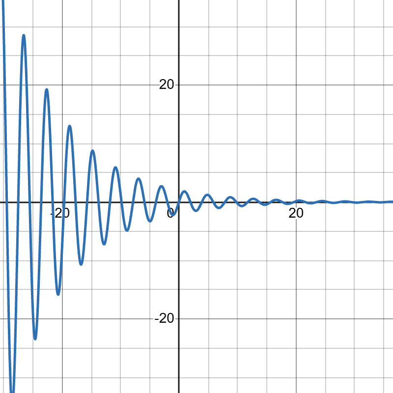

### Assignment I
Generate ramp signals.

`(i)`
```
t = [0:20];
y = t;
plot(t, y);
xlabel('Time');
ylabel('Amplitude');
title('Ramp Signal');
```


`(ii)`
```
t = [12 : 120];
y = t;
plot(t, y, "*r");
xlabel('Time');
ylabel('Amplitude');
title('Ramp Signal');
```


`(iii)`
```
t = [16.152 : 101.115];
y = t;
plot(t, y, 'sc');
xlabel('Time');
ylabel('Amplitude');
title('Ramp Signal');
```


### Assignment II:
Generate an Unit Impulse Signal.

`(i)`
```
t = [-10 : 10];
y = [zeros(1, 10) 1 zeros(1, 10)];
plot(t, y);
xlabel('Time');
ylabel('Amplitude');
title('Unit Impulse');
```


`(ii)`
```
t = [-5 : 10];
y = [zeros(1, 5) 1 zeros(1, 10)];
plot(t, y, 'om');
xlabel('Time');
ylabel('Amplitude');
title('Unit Impulse');
```


`(iii)`
```
t = [-30 : 30];
y = [zeros(1, 30) 1 zeros(1, 30)];
plot(t, y, '*m');
xlabel('Time');
ylabel('Amplitude');
title('Unit Impulse');
```


### Assignment III:
Generate an Unit Step Signal.

`(i)`
```
t = [0 : 15];
y = ones(1, length(t));
plot(t, y);
xlabel('Time');
ylabel('Amplitude');
title('Unit Step Signal');
```


`(ii)`
```
t = [0 : 20];
y = ones(1, length(t));
plot(t, y);
xlabel('Time');
ylabel('Amplitude');
title('Unit Step Signal');
```


`(iii)`
```
t = [-15 : 15];
y = [zeros(1, 15) ones(1, 16)];
plot(t, y, '*r');
xlabel('Time');
ylabel('Amplitude');
title('Unit Step Signal');
```


### Assignment IV:
Generate a Random Signal.

`(i)`
```
t = [0 : 0.07 : 10];
y = rand(1, length(t));
plot(t, y);
xlabel('Time');
ylabel('Amplitude');
title('Random Signal');
```


`(ii)`
```
t = [0 : 0.98 : 15];
y = rand(1, length(t));
plot(t, y);
xlabel('Time');
ylabel('Amplitude');
title('Random Signal');
```


`(iii)`
```
t = [0 : 1 : 5];
y = rand(1, length(t));
plot(t, y);
xlabel('Time');
ylabel('Amplitude');
title('Random Signal');
```


### Assignment V:
Generate a Sine Wave.

`(i)`
```
t = [0 : 0.05 : 55];
y = sin(t);
plot(t, y, 'r');
xlabel('Time');
ylabel('Amplitude');
title('Sine Wave');
```


`(ii)`
```
t = [1 : 0.095 : 50];
y = sin(t);
plot(t, y, 'm');
xlabel('Time');
ylabel('Amplitude');
title('Sine Wave');
```


`(iii)`
```
A = 1;
f = 0.67;
phi = 0;

t = [0 : 0.05 : 15];
y = A .* sin(2 .* %pi .* f .* t + phi);

plot(t, y, 'b');
xlabel('Time');
ylabel('Amplitude');
title('Sine Wave');
```


`(iv)`
```
A = 1;
f = 2.5;
phi = 0;

t = [1 : 0.01 : 5];
y = A .* sin(2 .* %pi .* f .* t + phi);

plot(t, y, 'b');
xlabel('Time');
ylabel('Amplitude');
title('Sine Wave');
```


`(v)`
```
A = 1;
f = 2.5;
phi = 0;

t = [1 : 0.123 : 25];
y = A .* sin(2 .* %pi .* f .* t + phi);

plot(t, y, 'b');
xlabel('Time');
ylabel('Amplitude');
title('Sine Wave');
```


### Assignment VI:
Generate a Cosine Wave.

`(i)`
```
A = 1;
phi = 0;

t = [0 : 0.0758 : 10];
y = cos(t);
plot(t, y);
xlabel('Time');
ylabel('Amplitude');
title('Cosine Wave');
```


`(ii)`
```
t = [1 : 0.0758 : 105];
y = cos(t);
plot(t, y, 'r');
xlabel('Time');
ylabel('Amplitude');
title('Cosine Wave');
```


`(iii)`
```
A = 1;
f = 2.5;
phi = 0;

t = [7 : 0.01 : 15.5];
y = A .* cos(2 .* %pi .* f .* t + phi);

plot(t, y, 'b');
xlabel('Time');
ylabel('Amplitude');
title('Cosine Wave');
```


`(iv)`
```
A = 1;
f = 2.5;
phi = 0;

t = [0 : 0.093 : 15.5];
y = A .* cos(2 .* %pi .* f .* t + phi);

plot(t, y, 'r');
xlabel('Time');
ylabel('Amplitude');
title('Cosine Wave');
```


### Assignment VII:
Generate an Exponential Wave.

`(i)`
```
t = [-30 : 0.8 : 7.53];
y = exp(t);

plot(t, y);
xlabel('Time');
ylabel('Amplitude');
title('Exponential Wave');
```


`(ii)`
```
t = [-3 : 0.09 : 7.53];
alpha = 4;
y = exp(-alpha .* t);

plot(t, y);
xlabel('Time');
ylabel('Amplitude');
title('Exponential Wave');
```


`(iii)`
```
t = [-3 : 0.05 : 35];
alpha = 0.078;
y = exp(alpha .* t);

plot(t, y);
xlabel('Time');
ylabel('Amplitude');
title('Exponential Wave');
```


### Assignment VIII:
Generate a Damped Sine Wave.

`(i)`
```
t = [0 : 0.09 : 15];
y = exp(-t) .* sin(t);

plot(t, y);
xlabel('Time');
ylabel('Amplitude');
title('Damped Sine Wave');
```


`(ii)`
```
t = [1 : 0.007 : 105.3];
y = exp(-t) .* sin(t);

plot(t, y);
xlabel('Time');
ylabel('Amplitude');
title('Damped Sine Wave');
```


`(iii)`
```
t = [0 : 0.05 : 10];
A = 1;
alpha = 2.98;
f = 6;
phi = 0;

y = A .* exp(-alpha .* t) .* sin(2 .* %pi .* f .* t + phi);

plot(t, y);
xlabel('Time');
ylabel('Amplitude');
title('Damped Sine Wave');
```


`(iv)`
```
t = [0 : 0.005 : 20];
A = 1;
alpha = 6;
f = 2.5;
phi = 0;

y = A .* exp(-alpha .* t) .* sin(2 .* %pi .* f .* t + phi);

plot(t, y, 'r');
xlabel('Time');
ylabel('Amplitude');
title('Damped Sine Wave');
```


### Conclusion

This experiment demonstrates the generation and visualisation of various standard signals in Scilab, including impulse, step, random, sinusoidal, exponential and damped sinusoidal waveforms.

## Experiment III
Operations of signals

### Aim 
To implement basic operations of signals using SciLab.

### Theory 
`(i).` Amplitude Scaling -
The process of rescaling the amplitude of a signal is called amplitude scaling.
As per example the amplitude of the signal is either amplified or attenuated.

Example for continuous-time signal.
`x(t)` is defined as `y(t) = A.x(t)`, where A is a constant.
```
if A >= 1, amplified
   A <  1, attenuated 
```

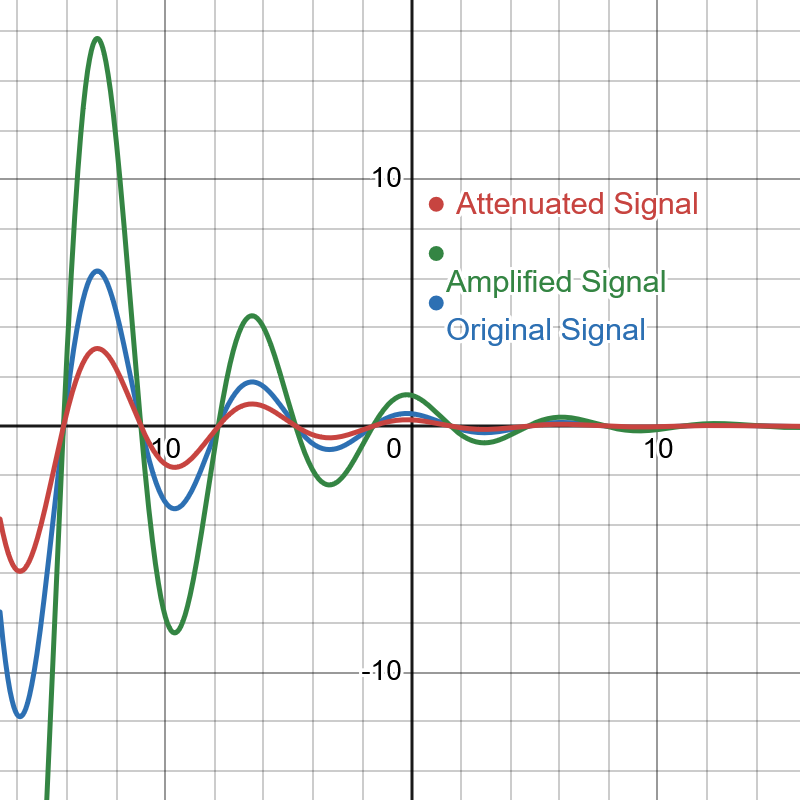

`(ii).` Time Reversal -
The time reversal of a signal is folding of a signal about the time region `(t = 0)`. It is also known as the reflection of the signal about the time origin `t = 0`.
For a continuous time signal `y(t) = x(-t)`.

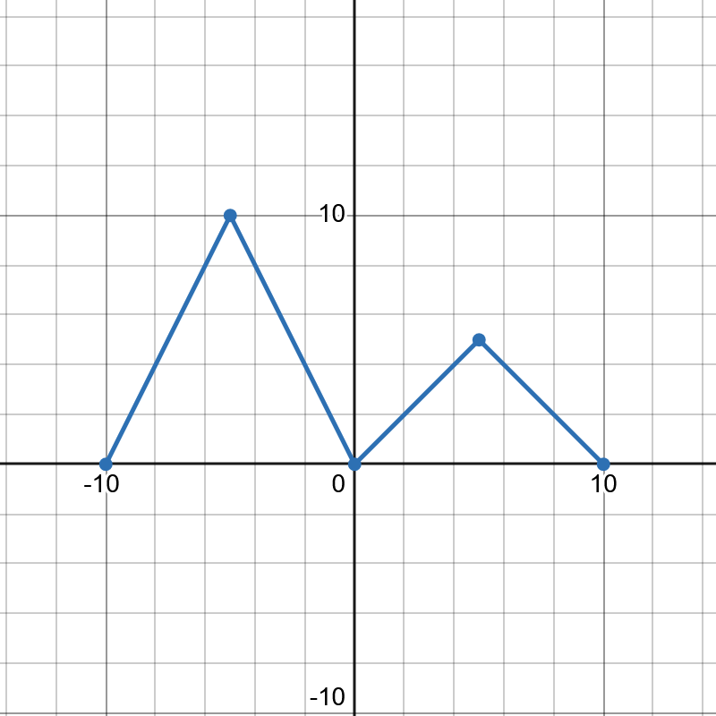
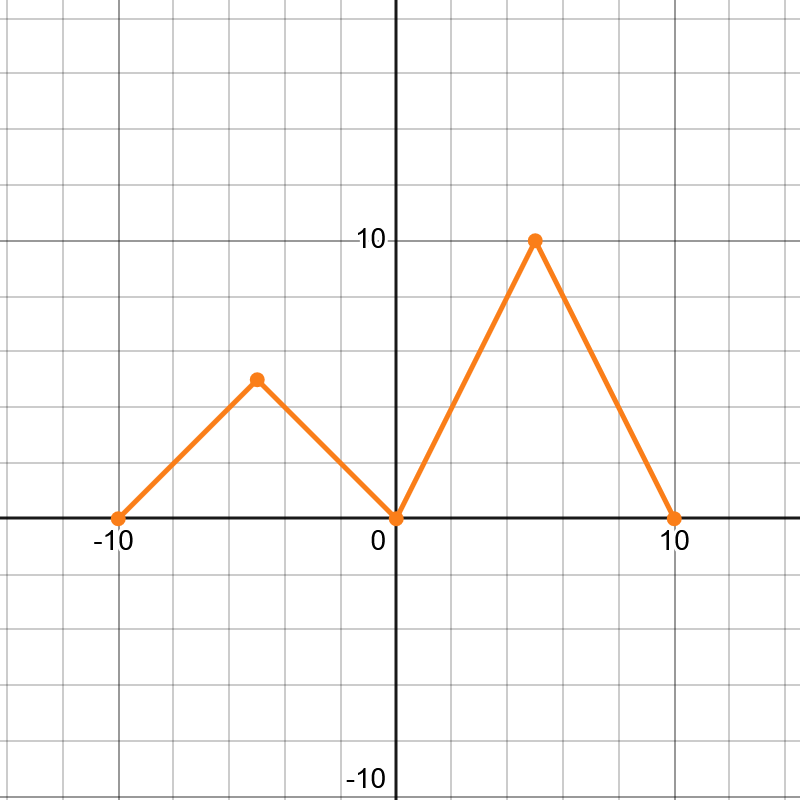

`(iii).` Time Shifting -
Time shifting or shifting of a signal in time refers to the signal being either delayed or advanced with respect to time.

For a continuous time signal - 
`y(t) = x(t - t_0)`
`t_0` is a constant and refers to the amount and direction of the shift.

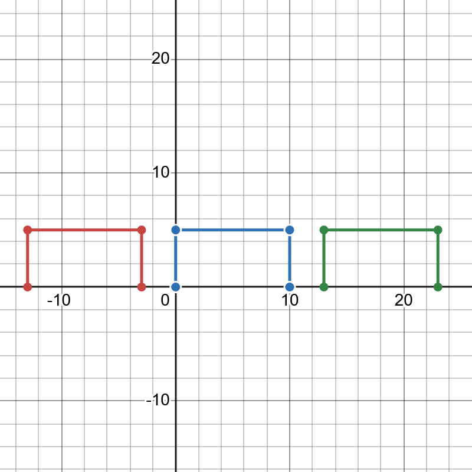
> [!NOTE]
> Here blue is the original signal `x(t)`, while red is `x(t + 13)`, and green is `x(t - 13)`.

`(iv).` Time Scaling - 
The process of multiplying a constant to the time axis of a signal is known as time scaling. It may be time compression or time expansion depending upon the value of the constant.
For a continuous time signal `y(t) = x(alpha * time)`.

### Assignment I
Do amplitude scaling for a random signal, sine wave, unit step signal.

`(i).` Random Signal
``` 
t = [-5 : 5];
y = [0, 3, 6, 5, -3, 8, 9, -2, 15, -7, 5];

subplot(3, 1, 1);
plot(t, y, 'magenta');
xlabel('Time');
ylabel('Amplitude');
title('Original Signal');

A = 0.5678;
y1 = A .* y;
subplot(3, 1, 2);
plot(t, y1, 'red');
xlabel('Time');
ylabel('Amplitude');
title('Attenuated Signal');

A = 12.13;
y2 = A .* y;
subplot(3, 1, 3);
plot(t, y2, 'blue');
xlabel('Time');
ylabel('Amplitude');
title('Amplified Signal');
```


`(ii).` Sine Wave
```
t = [0 : 0.059 : 15];
f = 0.5;
phi = 0;
y = sin(2 .* %pi .* f .* t + phi); //wt + phi, w = 2PIf

subplot(3, 1, 1);
plot(t, y, 'magenta');
xlabel('Time');
ylabel('Amplitude');
title('Original Signal');

A = 0.5678;
y1 = A .* y;
subplot(3, 1, 2);
plot(t, y1, 'red');
xlabel('Time');
ylabel('Amplitude');
title('Attenuated Signal');

A = 12.13;
y2 = A .* y;
subplot(3, 1, 3);
plot(t, y2, 'blue');
xlabel('Time');
ylabel('Amplitude');
title('Amplified Signal');
```


`(iii).` Unit Step Signal
```
t = [10 : 65];
y = 1;

subplot(3, 1, 1);
plot(t, y, 'magenta');
xlabel('Time');
ylabel('Amplitude');
title('Original Signal');

A = 0.5678;
y1 = A .* y;
subplot(3, 1, 2);
plot(t, y1, 'red');
xlabel('Time');
ylabel('Amplitude');
title('Attenuated Signal');

A = 12.13;
y2 = A .* y;
subplot(3, 1, 3);
plot(t, y2, 'blue');
xlabel('Time');
ylabel('Amplitude');
title('Amplified Signal');
```


### Assignment II:

Do time reversal for a random signal, cosine wave, sine wave.

`(i).` Random Signal

```
t = [-2 : 6];
y = [1, 5, -9, 12, 6, 0, -3, 10.5, -4];

subplot(2, 1, 1);
plot(t, y);
xlabel('Time');
ylabel('Amplitude');
title('Original Signal');

subplot(2, 1, 2);
plot(-t, y, 'r');
xlabel('Time');
ylabel('Amplitude');
title('Reverse Signal');
```


`(ii).` Cosine Signal

```
t = [0 : 0.08 : 15];
A = 1;
f = 2;
phi = 0;
y = A .* cos(2 .* %pi .* f .* t + phi);

subplot(2, 1, 1);
plot(t, y);
xlabel('Time');
ylabel('Amplitude');
title('Original Signal');

subplot(2, 1, 2);
plot(-t, y, 'r');
xlabel('Time');
ylabel('Amplitude');
title('Reverse Signal');
```


`(iii).` Sine Signal

```
t = [0 : 0.08 : 15];
A = 1;
f = 2;
phi = 0;
y = A .* sin(2 .* %pi .* f .* t + phi);

subplot(2, 1, 1);
plot(t, y);
xlabel('Time');
ylabel('Amplitude');
title('Original Signal');

subplot(2, 1, 2);
plot(-t, y, 'r');
xlabel('Time');
ylabel('Amplitude');
title('Reverse Signal');
```


### Assignment III:

Do time shifting for a random signal, unit impulse signal and damped sine wave.

`(i).` Random Signal

```id="x9k3lp"
t = [-2 : 6];
y = [1, 5, -9, 12, 6, 0, -3, 10.5, -4];
t_0 = 5;

subplot(3, 1, 1);
plot(t, y, 'black');
xlabel('Time');
ylabel('Amplitude');
title('Original Signal');

subplot(3, 1, 2);
plot(t + t_0, y, 'blue');
xlabel('Time');
ylabel('Amplitude');
title('Advanced Signal');

subplot(3, 1, 3);
plot(t - t_0, y, 'red');
xlabel('Time');
ylabel('Amplitude');
title('Delayed Signal');
```


`(ii).` Unit Impulse Signal

```id="a7v2mz"
t = [-6 : 6];
y = [zeros(1, 6) 1 zeros(1, 6)];
t_0 = 5;

subplot(3, 1, 1);
plot(t, y, 'black');
xlabel('Time');
ylabel('Amplitude');
title('Original Signal');

subplot(3, 1, 2);
plot(t + t_0, y, 'blue');
xlabel('Time');
ylabel('Amplitude');
title('Advanced Signal');

subplot(3, 1, 3);
plot(t - t_0, y, 'red');
xlabel('Time');
ylabel('Amplitude');
title('Delayed Signal');
```


`(iii).` Damped Sine Wave

```id="n4q8rs"
A = 5;
alpha = 1.5;
f = 3.5;
phi = 0;

t = [0 : 0.5 : 100];
y = A .* exp(-alpha .* t) .* sin(2 .* %pi .* f .* t + phi);
t_0 = 5;

subplot(3, 1, 1);
plot(t, y, 'black');
xlabel('Time');
ylabel('Amplitude');
title('Original Signal');

subplot(3, 1, 2);
plot(t + 5, y, 'blue');
xlabel('Time');
ylabel('Amplitude');
title('Advanced Signal');

subplot(3, 1, 3);
plot(t - 5, y, 'red');
xlabel('Time');
ylabel('Amplitude');
title('Delayed Signal');
```


### Assignment IV:

Do time scaling for a random signal, ramp and unit impulse signal.

`(i).` Random Signal

```id="p3x7kd"
t = [-2 : 6];
y = [1, 5, -9, 12, 6, 0, -3, 10.5, -4];
alpha = 5;

subplot(3, 1, 1);
plot(t, y, 'black');
xlabel('Time');
ylabel('Amplitude');
title('Original Signal');

subplot(3, 1, 2);
plot(t .* alpha, y, 'blue');
xlabel('Time');
ylabel('Amplitude');
title('Expanded Signal');

subplot(3, 1, 3);
plot(t / alpha, y, 'red');
xlabel('Time');
ylabel('Amplitude');
title('Compressed Signal');
```


`(ii).` Ramp Signal

```id="z7m1qw"
t = [-5 : 20];
y = (abs(t) + t) / 2;
alpha = 5;

subplot(3, 1, 1);
plot(t, y, 'black');
xlabel('Time');
ylabel('Amplitude');
title('Original Signal');

subplot(3, 1, 2);
plot(t .* alpha, y, 'blue');
xlabel('Time');
ylabel('Amplitude');
title('Expanded Signal');

subplot(3, 1, 3);
plot(t / alpha, y, 'red');
xlabel('Time');
ylabel('Amplitude');
title('Compressed Signal');
```


`(iii).` Unit Impulse Signal

```id="q2v8nx"
t = [-6 : 6];
y = [zeros(1, 6) 1 zeros(1, 6)];
alpha = 5;

subplot(3, 1, 1);
plot(t, y, 'black');
xlabel('Time');
ylabel('Amplitude');
title('Original Signal');

subplot(3, 1, 2);
plot(t .* alpha, y, 'blue');
xlabel('Time');
ylabel('Amplitude');
title('Expanded Signal');

subplot(3, 1, 3);
plot(t / alpha, y, 'red');
xlabel('Time');
ylabel('Amplitude');
title('Compressed Signal');
```


### Assignment V:

Do addition of 2 signals.

`(i).` Random Signal

```id="h8n4rb"
t = [-3 : 5];

y1 = [-6, 8, 0, 5, 7, -12, 1, 10.5, -8];
subplot(3, 1, 1);
plot(t, y1);
xlabel('Time');
ylabel('Amplitude');
title('Random Signal #1');

y2 = [2, 5, 9, -6, 7, -4, -2, 0, 13];
subplot(3, 1, 2);
plot(t, y2);
xlabel('Time');
ylabel('Amplitude');
title('Random Signal #2');

subplot(3, 1, 3);
plot(t, y1 + y2, "black");
xlabel('Time');
ylabel('Amplitude');
title('Combined Signal');
```


`(ii).` Sine and Cosine

```id="m5k9yt"
t = [0 : 0.005 : 5];
A = 1;
f = 3;
phi = 0;

y1 = A .* sin(2 .* %pi .* f .* t + phi);
subplot(3, 1, 1);
plot(t, y1);
xlabel('Time');
ylabel('Amplitude');
title('Signal #1'); 

f = 1.5;
y2 = A .* cos(2 .* %pi .* f .* t + phi);
subplot(3, 1, 2);
plot(t, y2);
xlabel('Time');
ylabel('Amplitude');
title('Signal #2');

subplot(3, 1, 3);
plot(t, y1 + y2, "black");
xlabel('Time');
ylabel('Amplitude');
title('Combined Signal');
```


### Assignment VI

Do subtraction of signals.

`(i).` Random Signal

```id="c6t2vd"
t = [-2 : 6];

y1 = [-6, 8, 0, 5, 7, -12, 1, 10.5, -8];
subplot(3, 1, 1);
plot(t, y1);
xlabel('Time');
ylabel('Amplitude');
title('Random Signal #1');

y2 = [2, 5, 9, -6, 7, -4, -2, 0, 13];
subplot(3, 1, 2);
plot(t, y2);
xlabel('Time');
ylabel('Amplitude');
title('Random Signal #2');

subplot(3, 1, 3);
plot(t, y1 - y2, "black");
xlabel('Time');
ylabel('Amplitude');
title('Combined Signal');
```


`(ii).` Sine and decaying cosine

```id="r9w1ez"
t = [0 : 0.005 : 5];
A = 1;
f = 3;
alpha = 1.5;
phi = 0;

y1 = A .* sin(2 .* %pi .* f .* t + phi);
subplot(3, 1, 1);
plot(t, y1);
xlabel('Time');
ylabel('Amplitude');
title('Signal #1'); 

f = 1.5;
y2 = A .* exp(-alpha .* t) .* cos(2 .* %pi .* f .* t + phi);
subplot(3, 1, 2);
plot(t, y2);
xlabel('Time');
ylabel('Amplitude');
title('Signal #2');

subplot(3, 1, 3);
plot(t, y1 - y2, "black");
xlabel('Time');
ylabel('Amplitude');
title('Combined Signal');
```


### Conclusion
From this experiment I have gained knowledge about basic operations such as addition, subtraction and many more of signals. Also came to know about wave simplifications. 

## Experiment IV
Determine odd and even part of a signal

### Aim
To determine odd and even part for a continuous-time signal and discrete-time signal in SciLab.

### Theory
An even signal remains unchanged when its time is reversed, it means that it is symmetric around the vertical axis. While an odd signal becomes negative of itself when time is reversed, it is asymmetric around the origin. 

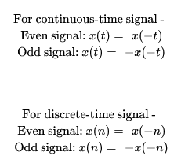

### Assignment I
Determine odd and even part of continuous-time signal.

```
t = [-3 : 3];
y = [13, 6, 1, 0, -2, -4, 12];

subplot(3, 1, 1);
plot(t, y, 'black');
xlabel("Time");
ylabel("Amplitude");
title("Original Signal");

c = 4;
for j = 1 : length(t)
    i = t(j);
    ye(j) = [0.5 * (y(c + i) + y(c - i))];
    yo(j) = [0.5 * (y(c + i) - y(c - i))];
end

subplot(3, 1, 2);
plot(t, ye, 'r');
xlabel("Time");
ylabel("Amplitude");
title("Even Signal");

subplot(3, 1, 3);
plot(t, yo, 'b');
xlabel("Time");
ylabel("Amplitude");
title("Odd Signal");
```


### Assignment II:
Determine odd and even part of discrete-time signal
```
n = [-3 : 3];
y = [13, 6, 1, 0, -2, -4, 12];

subplot(3, 1, 1);
plot2d3(n, y);
xlabel("Time");
ylabel("Amplitude");
title("Original Signal");

c = 4;
for j = 1 : length(n)
    i = n(j);
    ye(j) = [0.5 * (y(c + i) + y(c - i))];
    yo(j) = [0.5 * (y(c + i) - y(c - i))];
end

subplot(3, 1, 2);
plot2d3(n, ye);
xlabel("Time");
ylabel("Amplitude");
title("Even Signal");

subplot(3, 1, 3);
plot2d3(n, yo);
xlabel("Time");
ylabel("Amplitude");
title("Odd Signal");
```


### Conclusion:
From this experiment I have learnt about discrete-time and continuous-time signals. And how to determine the odd and even part of a signal.

## Experiment V
Determine power and energy of a signal.

### Aim
To determine power and energy of a signal using SciLab

### Theory
An energy signal is a signal with finite energy. (0 < E < ∞).
And a power signal is a signal with finite power. (0 < P < ∞).

For a continious signal `x(t)` we can find the energy and power of the signal as such - 
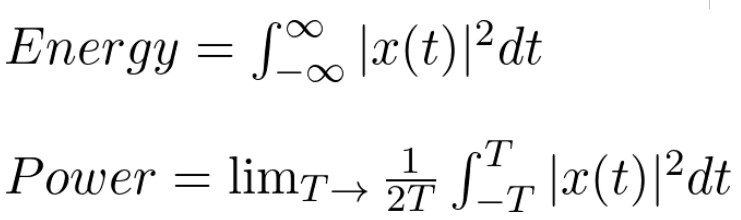

### Assignment I:
Determination of energy signal

```
t = [0 : 0.001 : 15];
y = 10 .* exp(-10 .* t);
E = integrate('(10 .* exp(-10 .* t)) ^ 2', 't', 0, 2 .* %pi);
disp('Energy of the signal: ', E);
```

`Output`
```
  "Energy of the signal: "

   5.0000000
```

### Assignment II:
Determination of power signal

```
t = [0 : 0.001 : 15];
y = 10 .* exp(-10 .* t);
P = integrate('(10 .* exp(-10 .* t)) ^ 2', 't', 0, 2 .* %pi) / (2 .* %pi);
disp('Power of the signal in Watts: ', P);
```

`Output` 
```
  "Power of the signal in Watts: "

   0.7957747
```

### Conclusion: 
In this experiment I have gained knowledge about energy and power of a signal. And how to calculate them for a particular signal.

## Experiment VI:
Convolution sum of 2 discrete sequences.

### Aim:
To determine convolution sum of 2 discrete sequences.

### Theory:
To determine convolution sum of the following discrete sequences using [Matrix method](https://en.wikipedia.org/wiki/Multidimensional_discrete_convolution).

`x1(n) = {0, -1, -2, 3, 1};`
`x2(n) = {4, -3, 2, 0, 1};`

Rewriting as table - 

```
        4    -3     2     0     1
      ----------------------------
 0  |   0     0     0     0     0
-1  |  -4     3    -2     0    -1
-2  |  -8     6    -4     0    -2
 3  |  12    -9     6     0     3
 1  |   4    -3     2     0     1
```

Then taking the diagonal elements we get
```
y[0] = 0
y[1] = 0 + (-4) = -4
y[2] = 0 + 3 + (-8) = -5
y[3] = 0 + (-2) + 6 + 12 = 16
y[4] = 0 + 0 + (-4) + (-9) + 4 = -9
y[5] = (-1) + 0 + 6 + (-3) = 2
y[6] = (-2) + 0 + 2 = 0
y[7] = 3 + 0 = 3
y[8] = 1

y[n] = {0, -4, -5, 16, -9, 2, 0, 3, 1}
```

### Assignment I:
Calculate convolution sum for 2 discrete sequences by matrix method.

```
n1 = [0 : 4];
y1 = [0, -1, -2, 3, 1];

subplot(3, 1, 1);
plot2d3(n1, y1);
title('Signal#1');

n2 = [0 : 4];
y2 = [4, -3, 2, 0, 1];

subplot(3, 1, 2);
plot2d3(n2, y2);
title('Signal#2');

y = convol(y1, y2);
disp('Convolution Sum: ', y);

L = length(y);
n = [0: L - 1];

subplot(3, 1, 3);
plot2d3(n, y);
title('Final Signal');
```

`Output`
```
"Convolution Sum: "

   6.661D-16  -4.  -5.   16.  -9.   2.   1.570D-16   3.   1.
```


> [!NOTE]
> The weird values you see with `D` should be 0.

### Conclusion: 
In this experiment I have gained knowledge about convolution sum. Calculated convolution sum for 2 sequences theoretically and justified the answer by practical approach using SciLab.

## Experiment VII
Convolution integral of 2 continuous-time signals.

### Aim
To determine convolution integral of 2 continuous-time signals using SciLab.

### Theory
The convolution integral is a Mathematical operation used to determine the output of a linear time-invariant (LTI) system, where the input and the system's impulse response are known. 
Let `x(t)` be the input signal and `h(t)` be the impulse signal.

Then the convolution is given by -
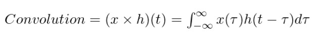

### Assignment I:
Find the convolution integral of 2 continuous-time signals.

```
T = 10;
y1 = ones(1, T);
t1 = [0 : length(y1) - 1];

subplot(3, 1, 1);
xlabel('Time');
ylabel('Amplitude');
title('Signal #1');
plot(t1, y1);

y2 = ones(1, T);
t2 = [0 : length(y2) - 1];
subplot(3, 1, 2);
xlabel('Time');
ylabel('Amplitude');
title('Signal #2');
plot(t2, y2);

y = convol(y1, y2) - 1;
disp('Convol Integral: ', y);
t = [0 : length(y1) + length(y2) - 2];

subplot(3, 1, 3);
xlabel('Time');
ylabel('Amplitude');
title('Convoluted Signal');
plot(t, y);
```

Output
```
  "Convol Integral: "

   2.220D-16   1.   2.   3.   4.   5.   6.   7.   8.   9.   8.   7.   6.   5.   4.   3.   2.   1.  -4.441D-16
```

### Conclusion: 
In this experiment I have gained knowledge about Convolution integral and performed it using SciLab.


## Practice Problems

### Question 1
Generate random signals at `t1 = [0 : 0.0392 : 26]`, `t2 = [1 : 1.123 : 13]` and do time shifting.

`Answer` [question1.sci](Practice%20Problems%20Files/question1.sci)


### Question 2
Generate two discrete time signals and add them.

`Answer` [question2.sci](Practice%20Problems%20Files/question2.sci)


### Question 3
Generate Unit Impulse and Unit Step signal.

`Answer` [question3.sci](Practice%20Problems%20Files/question3.sci)


### Question 4
Do Amplitude Scaling with unit ramp signal. Take A=10, B=0.529.

`Answer` [question4.sci](Practice%20Problems%20Files/question4.sci)


### Question 5
Do time scaling with damped sine wave. Take t=[0:0.114:45].

`Answer` [question5.sci](Practice%20Problems%20Files/question5.sci)


### Question 6
Do subtraction with one cos wave and one sine wave.

`Answer` [question6.sci](Practice%20Problems%20Files/question6.sci)


### Question 7
Generate ramp signal and do time shifting with ramp signal.

`Answer` [question7.sci](Practice%20Problems%20Files/question7.sci)


### Question 8
Do time reversal and time scaling with unit step signal.

`Answer` [question8.sci](Practice%20Problems%20Files/question8.sci)


### Question 9
Take two discrete time signals and do addition.

`Answer` [question9.sci](Practice%20Problems%20Files/question9.sci)


### Question 10
Determine odd and even part for continuous time signal.

`Answer` [question10.sci](Practice%20Problems%20Files/question10.sci)


### Question 11
Do amplitude scaling for two random discrete signals.

`Answer` [question11.sci](Practice%20Problems%20Files/question11.sci)


### Question 12
Determine convolution sum of two discrete signals.

`Answer` [question12.sci](Practice%20Problems%20Files/question12.sci)


### Question 13
Do convolution Integral of two continuous time signals.

`Answer` [question13.sci](Practice%20Problems%20Files/question13.sci)


### Question 14
Do time shifting with unit impulse signal.

`Answer` [question14.sci](Practice%20Problems%20Files/question14.sci)


### Question 15
Take two discrete time sequence and do subtraction.

`Answer` [question15.sci](Practice%20Problems%20Files/question15.sci)


### Question 16
Generate sine waves and subplot them.

`Answer` [question16.sci](Practice%20Problems%20Files/question16.sci)


### Question 17
Generate a sine wave and a damped sine wave and add them.

`Answer` [question17.sci](Practice%20Problems%20Files/question17.sci)

